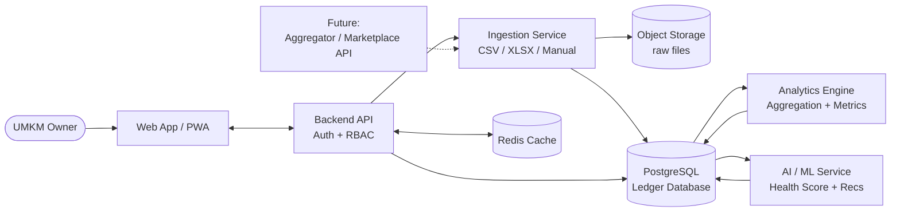

# 2ND SUBMISSION PROPOSAL — DIGDAYA x HACKATHON 2026
# PULSA — Payment Understanding & Ledger for Smart Analytics

---

## 1. TEAM IDENTITY

### Team ID
*[Diisi sesuai Team ID resmi dari panitia tahap 1]*

### Team Name
404 Inovators

### Proposal Title
PULSA — Payment Understanding & Ledger for Smart Analytics: Platform Analitik Transaksi & Data Alternatif untuk UMKM Indonesia

### Team Composition *(maks. 120 kata)*

| Peran | Nama | Tanggung jawab utama |
|---|---|---|
| Product Lead / Full-Stack Engineer | Beni Handoko | Strategi produk, arsitektur sistem, full-stack development, validasi UMKM |
| Software Engineer / Data Engineer | Moch Arsya Adzma Syahputra | Backend, ingestion pipeline, analytics engine, implementasi Business Health Score |

Tim **404 Inovators** adalah tim *engineering* kecil dengan latar belakang *software development*, *data engineering*, dan AI/ML. Kombinasi kompetensi ini memungkinkan kami merancang dan membangun PULSA dari arsitektur hingga fitur — dari ingestion data hingga model analitik. Tim kecil yang fokus juga memungkinkan iterasi cepat dan keputusan produk yang lincah, cocok untuk tahap MVP yang membutuhkan kecepatan validasi.

### Executive Summary *(maks. 150 kata)*

PULSA (*Payment Understanding & Ledger for Smart Analytics*) menjawab kesenjangan antara digitalisasi pembayaran yang sudah masif dengan rendahnya pemanfaatan data transaksi oleh UMKM. Target pengguna utama adalah UMKM kuliner, retail, dan jasa yang sudah menerima pembayaran digital (QRIS, marketplace, transfer) tetapi tidak memiliki alat analitik bisnis yang sederhana. Solusi inti kami mengonsolidasi transaksi multi-channel menjadi satu ledger usaha, menghasilkan insight bisnis harian, **Business Health Score**, dan rekomendasi berbasis AI yang dapat langsung ditindaklanjuti. Sejak submission pertama, kami menajamkan tiga hal: (1) prototype web interaktif berisi 7 modul fungsional yang dapat diakses publik, (2) metodologi Business Health Score dengan 5 komponen terdefinisi, dan (3) target dampak konservatif yang lebih terukur (500 UMKM tahun pertama, scale ke 25.000 dalam tiga tahun). Dampak yang ditargetkan: peningkatan kualitas keputusan bisnis UMKM, fondasi data alternatif untuk credit scoring, dan penguatan inklusi keuangan nasional.

---

## 2. PROBLEM ALIGNMENT & REFINEMENT

### Problem Statement
**Peningkatan Produktivitas, Ketahanan Pangan, dan Penciptaan Lapangan Kerja → Inklusi Ekonomi (UMKM)**

### Primary Sub-Problem Statement
**Pemanfaatan Data Alternatif / Credit Scoring**

### Problem Validation *(maks. 180 kata)*

Masalah inti yang ingin diselesaikan adalah kesenjangan antara digitalisasi pembayaran yang sudah masif dengan rendahnya pemanfaatan data transaksi untuk analisis bisnis dan penilaian kapasitas usaha UMKM. Setelah adopsi QRIS naik tajam, banyak UMKM kuliner, retail, dan jasa menerima pembayaran digital setiap hari, namun data tersebut hanya berhenti sebagai rekap transaksi.

Akar masalahnya berlapis: (1) data tersebar di banyak kanal — QRIS, marketplace, transfer bank, dan input manual — tanpa konsolidasi; (2) aplikasi pembayaran hanya memberi ringkasan dasar; (3) alat analitik kelas enterprise terlalu mahal dan kompleks untuk pelaku usaha mikro; (4) belum ada bahasa sederhana yang menerjemahkan pola transaksi menjadi keputusan bisnis sehari-hari.

Dampaknya, mayoritas UMKM mengambil keputusan operasional — stok, jam buka, promo — berdasarkan intuisi, bukan data. Pada saat yang sama, aktivitas transaksi yang sebenarnya bisa menjadi data alternatif untuk credit scoring tidak pernah terangkat menjadi profil usaha yang terstruktur, sehingga akses pembiayaan formal tetap sulit. Masalah ini memperlebar kesenjangan inklusi ekonomi UMKM.

### Problem–Solution Mapping *(maks. 180 kata)*

PULSA memetakan setiap masalah inti ke mekanisme solusi dan outcome terukur:

**Problem 1 — Data transaksi tersebar di banyak kanal**
→ Mekanisme: Modul ingestion multi-channel (upload CSV/XLSX, input manual, ke depan integrasi API agregator) yang mengonsolidasi ke satu ledger usaha.
→ Outcome: UMKM memiliki *single source of truth* untuk seluruh transaksi.

**Problem 2 — UMKM tidak mengenali pola bisnisnya sendiri**
→ Mekanisme: Analytics engine menghasilkan tren revenue, peak hours heatmap, performa produk, dan analisis channel.
→ Outcome: Pelaku usaha mengenal jam tersibuk, produk terlaris, dan hari peak yang dapat langsung ditindaklanjuti.

**Problem 3 — Keputusan operasional berbasis intuisi**
→ Mekanisme: Business Health Score (5 komponen) + rekomendasi AI berbasis pola historis (stok, jam buka, bundling promo).
→ Outcome: Rekomendasi mingguan yang ringkas, terklasifikasi prioritas, dan mudah dieksekusi.

**Problem 4 — Data alternatif untuk credit scoring tidak terangkat**
→ Mekanisme: Ledger terstruktur + Health Score sebagai profil usaha yang dapat dibagikan ke lembaga keuangan dengan persetujuan pengguna.
→ Outcome: Fondasi penilaian usaha berbasis aktivitas ekonomi nyata yang lebih inklusif.

### Ecosystem Alignment *(maks. 150 kata)*

PULSA berdiri di tengah ekosistem digitalisasi pembayaran nasional dan terhubung dengan empat lapis stakeholder. **Regulator**: Bank Indonesia melalui kerangka QRIS dan Blueprint Sistem Pembayaran 2025 sebagai fondasi infrastruktur transaksi, serta OJK terkait penilaian usaha dan kepatuhan UU Perlindungan Data Pribadi. **Lembaga keuangan & agregator**: bank, koperasi, dan agregator pembayaran (Midtrans, Xendit, dan QRIS aggregator lain) sebagai sumber data dan mitra distribusi potensial. **Lembaga pendamping UMKM**: Kementerian Koperasi & UKM, asosiasi UMKM daerah, serta komunitas pelaku usaha sebagai kanal adopsi. **UMKM** sebagai pengguna utama. Batasan implementasi yang diperhatikan: kepatuhan UU PDP No. 27/2022, persetujuan eksplisit pengguna untuk pemrosesan data, dan keterbatasan akses langsung ke API marketplace yang membutuhkan kerja sama formal. PULSA dirancang untuk berkembang bertahap dari ingestion mandiri ke integrasi resmi seiring tumbuhnya kepercayaan ekosistem.

---

## 3. SOLUTION & IMPACT DEEP DIVE

### Solution Approach & Mechanism *(maks. 250 kata)*

PULSA bekerja *end-to-end* dalam empat tahap.

**Input.** Data transaksi masuk melalui tiga jalur: (a) upload file (CSV/XLSX dari export QRIS, POS, marketplace, atau mutasi bank), (b) input manual untuk transaksi tunai, dan (c) ke depan, integrasi API dengan agregator pembayaran.

**Proses.** Modul ingestion menormalisasi format, melakukan deduplikasi referensi, memetakan kategori produk, dan menyimpan ke ledger usaha tunggal. Analytics engine mengekstrak fitur — frekuensi transaksi, nilai rata-rata, tren omzet, stabilitas pendapatan, pola jam, diversitas channel — yang menjadi dasar dashboard. AI engine ringan (rule-based + regresi sederhana, dapat dikembangkan ke gradient boosting) memproses pola historis untuk membentuk **Business Health Score** (0–100 dari 5 komponen: Revenue Stability, Transaction Frequency, Customer Diversity, Channel Diversity, Growth Trend) dan rekomendasi *actionable* (contoh: tambah stok produk X di hari Y, bundling promo, optimasi jam buka).

**Output.** Dashboard web menampilkan KPI utama, tren revenue, heatmap peak hours, performa produk, donut channel, breakdown health score, dan daftar rekomendasi terklasifikasi (stok/operasional/promosi).

**Interaksi pengguna.** UMKM mengakses melalui browser tanpa instalasi tambahan, dengan opsi PWA untuk mobile.

**Penajaman dari proposal sebelumnya**: (1) prototype web interaktif sudah siap dan dapat diakses publik sebagai bukti kelayakan UX, (2) Business Health Score sekarang punya 5 komponen terdefinisi dengan komputasi terstruktur, bukan lagi konsep abstrak, (3) flow ingestion menambahkan jalur manual untuk UMKM yang transaksinya masih sebagian tunai, sehingga adopsi tidak terhambat pada UMKM yang belum sepenuhnya digital.

*Lihat lampiran:* `attachments/data_flow_diagram.png` — diagram alur input → processing → analytics & AI → output.

### Impact Scale & Targets *(maks. 230 kata)*

PULSA menargetkan dampak pada tiga lapisan: pengguna langsung, ekosistem keuangan, dan ekonomi UMKM nasional.

**Target jumlah pengguna (konservatif):**
- **Tahun 1**: 500 UMKM aktif di kota Tier 1–2 (fokus Jabodetabek, Bandung, Yogyakarta, Surabaya) dengan konsentrasi sektor F&B dan retail.
- **Tahun 2**: 5.000 UMKM melalui kerja sama dengan agregator pembayaran dan asosiasi UMKM daerah.
- **Tahun 3**: 25.000 UMKM dengan ekspansi ke kota Tier 2–3 dan kategori usaha tambahan (jasa, fashion).

**Manfaat per pengguna:**
- Pengurangan waktu rekapitulasi manual ±2 jam/minggu per UMKM.
- Akses ke insight yang setara *enterprise tools* (peak hours, produk terlaris, stabilitas omzet) tanpa biaya tinggi.
- Visibilitas Business Health Score sebagai profil usaha yang dapat dibagikan.

**Manfaat sistemik:**
- Data alternatif terstruktur dari ribuan UMKM yang dapat memperkaya basis penilaian usaha non-tradisional.
- Peningkatan literasi data UMKM secara progresif.
- Penguatan disiplin pencatatan transaksi sebagai prasyarat akses pembiayaan formal.

**Skala data yang diproses:**
- Tahun 1: ±1,5 juta transaksi/bulan (rata-rata 100 transaksi/hari × 500 UMKM × 30 hari).
- Tahun 3: ±75 juta transaksi/bulan.

Target ini dipilih konservatif agar realistis untuk MVP dengan tim kecil, namun tetap menyediakan ruang pertumbuhan signifikan ketika kemitraan distribusi terbentuk.

### Impact Measurement *(maks. 270 kata)*

Keberhasilan PULSA diukur melalui indikator kuantitatif dalam empat kategori.

**1. Adopsi & Engagement**
- *Monthly Active Users (MAU)*: 60% dari registered users dalam 6 bulan pertama
- Rata-rata sesi per pengguna per minggu: ≥3 sesi
- *Retention rate* 30-hari: ≥40% pada tahun pertama
- *Onboarding completion rate*: ≥75% (dari sign-up ke transaksi pertama)

**2. Pemanfaatan Insight**
- Persentase pengguna yang melihat dashboard ≥1×/minggu: ≥70%
- Persentase rekomendasi prioritas tinggi yang ditandai "diterapkan": ≥25%
- *Average Business Health Score improvement* per user dalam 6 bulan: +5 poin
- *Self-reported confidence* dalam keputusan bisnis (survey 6-bulanan): peningkatan ≥30%

**3. Kualitas Data & Ledger**
- Rata-rata jumlah channel terhubung per UMKM: ≥2 dalam 3 bulan
- Konsistensi pencatatan transaksi: ≥80% hari aktif dalam periode 30 hari
- Volume transaksi tercatat per UMKM per bulan: ≥150

**4. Dampak Ekosistem**
- Jumlah agregator/lembaga keuangan yang bermitra integrasi data: ≥3 dalam 18 bulan
- Persentase UMKM yang menyetujui *sharing* skor untuk *credit scoring* eksternal: ≥40%
- *Average revenue uplift* pengguna aktif yang menerapkan ≥3 rekomendasi (case study sample): +10–15%

Pengukuran dilakukan melalui *in-app analytics*, *survey* pengguna kuartalan, wawancara case study, dan rekapitulasi data ledger anonim. Dashboard internal akan menampilkan semua KPI ini dengan target dan progres per bulan untuk evaluasi rutin. Indikator ini sengaja dipilih agar tetap dapat diukur pada skala MVP (500 pengguna), namun proportional untuk skala 25.000 pengguna di tahun ketiga.

### System & Public Value Proposition *(maks. 200 kata)*

Nilai sistemik PULSA tidak berhenti pada efisiensi operasional satu UMKM, tetapi merambat ke sistem yang lebih luas.

**Inklusi keuangan & data alternatif**: Ledger transaksi terstruktur dan Business Health Score memberikan fondasi data yang sebelumnya tidak ada untuk segmen UMKM kecil yang belum tersentuh credit scoring konvensional. Lembaga keuangan dan koperasi mendapat sinyal kelayakan usaha yang lebih objektif daripada sekadar dokumen administratif.

**Kualitas data ekosistem**: Dengan ribuan UMKM yang mendisiplinkan pencatatan, kualitas data agregat di sektor UMKM membaik. Ini mendukung pemetaan ekonomi mikro untuk perumusan kebijakan publik (pemerintah daerah, BI, Kemenkop UKM).

**Penguatan literasi data**: Bahasa sederhana — "produk terlaris", "jam tersibuk", "health score" — membuat UMKM terbiasa mengambil keputusan berbasis data. Transformasi perilaku jangka panjang ini nilainya akumulatif.

**Efisiensi rantai pembiayaan**: Lembaga keuangan dapat menurunkan biaya verifikasi karena data alternatif sudah terstandardisasi, membuat pembiayaan UMKM kecil lebih ekonomis untuk disalurkan.

**Resiliensi UMKM**: UMKM yang mengenali pola bisnisnya beradaptasi lebih cepat terhadap perubahan musiman atau guncangan ekonomi, memperkuat ketahanan ekonomi mikro secara agregat.

---

## 4. INNOVATION & DIFFERENTIATION

### Solution Originality *(maks. 300 kata)*

Pendekatan yang sudah ada di Indonesia terbagi tiga kategori, masing-masing memiliki keterbatasan yang membuat PULSA tetap unik.

**Kategori 1 — Aplikasi pencatatan keuangan UMKM** (BukuKas, BukuWarung): fokus pencatatan manual dan ringkasan keuangan harian. *Keterbatasan*: tidak mengonsolidasi data kanal digital (QRIS, marketplace, transfer) dan tidak punya analytics mendalam atau *scoring*.

**Kategori 2 — Sistem Point-of-Sale** (Pawoon, MokaPOS, Olsera): kuat pada pencatatan penjualan di toko fisik. *Keterbatasan*: terbatas pada channel POS sendiri; tidak menjadi *hub* lintas channel; mahal untuk usaha mikro; tidak menawarkan profil usaha untuk *credit scoring*.

**Kategori 3 — Tools BI enterprise** (Jurnal/Mekari, Looker, Power BI): analytics luas. *Keterbatasan*: mahal, kompleks, tidak dirancang untuk UMKM mikro yang butuh insight sederhana langsung pakai.

**Pembeda PULSA:**

1. **Konsolidasi multi-channel sebagai default** — QRIS, POS, marketplace, transfer, manual semuanya masuk satu ledger. Belum ada solusi UMKM Indonesia yang menjadikan ini fitur inti.
2. **Business Health Score 5 komponen** — bahasa universal untuk kesehatan usaha berbasis data transaksi nyata, dengan metodologi terstruktur. Tidak ditemukan di solusi lain.
3. **Framing data alternatif untuk credit scoring** — PULSA bukan sekadar alat operasional, tapi jembatan menuju akses pembiayaan formal yang lebih inklusif.
4. **Bahasa UMKM-native** — rekomendasi konkret seperti "Tambah stok ayam bakar 20% di Jumat", bukan dashboard generik yang harus diinterpretasi sendiri.
5. **Lightweight & terjangkau** — model *freemium*, akses via PWA tanpa instalasi native, biaya operasional rendah untuk pengguna.

**Penajaman dari proposal sebelumnya**: PULSA sekarang punya *prototype interaktif* yang dapat dieksperimentasikan publik, dengan 5 komponen Health Score terdefinisi konkret beserta bobot dan metode komputasinya. Ini bukti bahwa diferensiasi PULSA realistis untuk dibangun, bukan sekadar klaim konseptual.

### Technological / Method Innovation *(maks. 240 kata)*

**Business Health Score: metodologi inti.** PULSA mengukur kesehatan usaha melalui 5 komponen yang diskor 0–100, dikombinasikan dengan bobot tertimbang:

| Komponen | Bobot | Metode |
|---|---|---|
| Revenue Stability | 25% | 1 − Coefficient of Variation harian, normalisasi terhadap median industri |
| Transaction Frequency | 20% | Rasio transaksi/hari vs benchmark sektor (F&B, retail, jasa) |
| Customer Diversity | 15% | Distribusi unique customer, indeks konsentrasi (Herfindahl-like) |
| Channel Diversity | 15% | Jumlah channel aktif + distribusi revenue per channel |
| Growth Trend | 25% | Slope regresi linear revenue 30 hari, normalisasi industri |

Skor akhir = Σ (komponen × bobot). Klasifikasi: 80–100 (A, Sangat Baik), 65–79 (B, Baik), 50–64 (C, Cukup), <50 (D, Perlu Perhatian).

**Algoritma analitik & rekomendasi:**

*Analytics layer*: *time-series aggregation* (harian/mingguan), *moving average* untuk *smoothing*, *heatmap density* untuk peak hours, dekomposisi pola weekday vs weekend.

*Rule-based recommendation engine* (MVP): aturan seperti "if revenue Hari X > avg + 1σ → boost stock 20%", diturunkan dari pola historis pengguna dan dapat dikalibrasi per kategori usaha.

*Future ML*: *gradient boosting* (XGBoost/LightGBM) untuk prediksi risiko dan *clustering* (k-means/HDBSCAN) untuk segmentasi UMKM sejenis sebagai *peer benchmark*.

Kombinasi *statistik klasik + ML ringan* dipilih karena: (a) dapat dijelaskan ke pengguna UMKM (penting untuk *trust*), (b) realistis dengan tim kecil dan data yang masih tumbuh, (c) dapat ditingkatkan ke model lebih kompleks ketika volume data sudah cukup.

### Creativity in Implementation *(maks. 250 kata)*

PULSA menerapkan beberapa pendekatan kreatif dalam distribusi, monetisasi, dan engagement.

**Distribusi via ekosistem yang sudah ada:**
- Kemitraan dengan *QRIS aggregator* (Midtrans, Xendit, atau penyedia PSP lain) untuk menyediakan PULSA sebagai *value-add* gratis bagi merchant binaan — distribusi *piggyback* tanpa biaya akuisisi besar.
- Kerja sama dengan asosiasi UMKM daerah dan komunitas (HIPMI, KUMKM, komunitas kuliner kota) untuk *onboarding* batch dan testimoni komunitas.
- Program *referral* antar UMKM dengan insentif fitur premium bulan tambahan.

**Monetisasi berlapis:**
- *Freemium individual* — fitur inti (dashboard, Health Score, 3 rekomendasi/minggu) gratis untuk UMKM tunggal.
- *Premium subscription* Rp 49.000–99.000/bulan untuk fitur lanjut: multi-cabang, export laporan, integrasi API langsung, rekomendasi tanpa batas.
- *Institutional licensing* — agregator, koperasi, dan lembaga keuangan membayar lisensi untuk akses dashboard portfolio anonim atau integrasi *credit scoring*.

**Engagement berbasis kebiasaan UMKM:**
- *Weekly summary via WhatsApp* — pengguna menerima ringkasan singkat ("Minggu ini omzet naik 12%, peak hour Sabtu 19:00") tanpa harus buka aplikasi.
- *Health Score badge* — dapat di-*share* ke media sosial atau profil bisnis (gamifikasi *soft*).
- *Onboarding terpandu* dengan sample dataset agar pengguna langsung melihat manfaat sebelum *upload* data sendiri.
- *Templated business goal* — pengguna memilih target (mis. naik omzet 10% bulan depan), rekomendasi disesuaikan dengan target.

Kreativitas ini memanfaatkan kanal yang sudah dipakai UMKM sehari-hari (WhatsApp, komunitas) sehingga PULSA terasa familiar — bukan platform baru yang harus dipelajari dari nol.

---

## 5. TECHNICAL VALIDATION

### System Architecture *(maks. 250 kata)*

Arsitektur PULSA dirancang modular berbasis layanan, dengan komponen utama yang dapat diskalakan terpisah.

**Frontend layer**: Aplikasi web responsif (HTML/CSS/JS, opsi migrasi ke framework reaktif di tahap lanjut) dengan PWA untuk akses mobile tanpa instalasi native. Dashboard terdiri dari navigasi, KPI cards, visualisasi chart, tabel transaksi, dan modul ingestion.

**Backend API**: Layanan REST yang menangani autentikasi (JWT + role-based access control), CRUD transaksi, query analytics, dan endpoint khusus untuk Business Health Score serta rekomendasi.

**Ingestion service**: Modul khusus parsing file (CSV/XLSX), validasi schema, deduplikasi referensi, normalisasi kategori produk, dan staging ke ledger. Mendukung input manual via form; siap menerima webhook/API agregator pembayaran di tahap lanjut.

**Ledger database**: PostgreSQL relasional sebagai *single source of truth* — tabel inti `users`, `businesses`, `transactions`, `products`, `categories`, `channels`, `daily_aggregates`.

**Analytics engine**: Pipeline Python (pandas/numpy) menjalankan agregasi terjadwal harian/mingguan untuk metrik: tren omzet, peak hours, performa produk, stabilitas pendapatan, diversitas channel.

**AI/ML service**: Komputasi Business Health Score (5 komponen, bobot tunable) dan rekomendasi berbasis rule + regresi sederhana untuk MVP; dapat diperluas ke gradient boosting/clustering.

**Infrastruktur pendukung**: object storage (S3-compatible) untuk file upload mentah; Redis cache untuk percepatan dashboard query; job scheduler untuk pipeline analytics.

**Alur sistem**: pengguna → Frontend → API → Ingestion → Ledger → Analytics Engine → AI Service → API → Dashboard. Komponen terpisah memungkinkan setiap layanan di-scale independen seiring pertumbuhan volume.

### Data & Feasibility *(maks. 200 kata)*

Data utama yang dibutuhkan PULSA adalah transaksi UMKM dengan field minimum: waktu, nominal, channel pembayaran, referensi transaksi, dan kategori produk. Sumber data dirancang multi-jalur agar adopsi tidak terhambat satu integrasi.

**Tersedia di tahap MVP** (realistis tanpa kerja sama institusional):
- *Export file* dari aplikasi QRIS issuer (BCA, Mandiri, BRI, dll.) dalam CSV/XLSX
- *Export marketplace* (Shopee, Tokopedia) dari seller dashboard
- *Mutasi rekening* CSV dari internet banking
- *Input manual* via form untuk transaksi tunai

**Membutuhkan kerja sama** (tahap lanjut):
- API agregator pembayaran (Midtrans, Xendit, atau QRIS aggregator) untuk integrasi *real-time*
- API marketplace untuk sinkronisasi otomatis

Kualitas data dijaga melalui validasi schema, deduplikasi berbasis referensi transaksi, normalisasi kategori produk (mapping ke taksonomi standar), dan deteksi anomali dasar (outlier nilai transaksi). Pada tahap awal, *dataset simulasi* yang menyerupai pola transaksi UMKM nyata dapat digunakan untuk demo dan pengujian.

Pendekatan multi-source membuat PULSA tidak bergantung pada satu kanal, sehingga profil usaha yang dihasilkan tetap representatif. Data input pengguna pertama dapat sepenuhnya berbasis file/manual tanpa ketergantungan API eksternal — realistis untuk fase peluncuran.

### Security & Compliance *(maks. 200 kata)*

PULSA menempatkan keamanan dan kepatuhan sebagai bagian inti, bukan *add-on*.

**Perlindungan data pribadi**: Patuh pada **UU No. 27/2022 (Perlindungan Data Pribadi)**. Konsen pengguna diperoleh eksplisit pada *onboarding*, dengan *opt-in* terpisah untuk pemrosesan lanjut seperti *sharing* skor ke lembaga keuangan. Prinsip *data minimization* — hanya field yang dibutuhkan analytics yang disimpan.

**Autentikasi & otorisasi**: JWT-based authentication; *role-based access control* (RBAC) memisahkan tier owner, staff, dan admin. Password disimpan dengan hashing bcrypt + salt.

**Enkripsi**: Data *in transit* dengan TLS 1.3 (HTTPS); data sensitif *at rest* (kredensial, identitas pengguna) dienkripsi AES-256. *Object storage* untuk file upload mengikuti enkripsi penyedia.

**Retensi & anonimisasi**: Data transaksi disimpan default 24 bulan, dengan opsi pengguna untuk *request* penghapusan. Data agregat untuk *benchmarking* ekosistem dianonimkan sebelum diproses.

**Audit & monitoring**: Log akses dan perubahan data tersimpan; sistem mendeteksi anomali login (brute force, IP unusual).

**Kepatuhan operasional**: Mengikuti pedoman OJK terkait penyelenggara inovasi teknologi sektor keuangan ketika fitur *credit scoring* diaktifkan, dengan opsi registrasi *regulatory sandbox* untuk validasi compliance sebelum *scale up*.

### Implementation Readiness (MVP) *(maks. 300 kata)*

**Scope MVP (12 bulan)** dipilih untuk memvalidasi nilai inti tanpa kompleksitas integrasi.

*Masuk MVP:*
1. **Ingestion**: Upload file CSV/XLSX (QRIS issuer, marketplace, bank statement) + input manual via form.
2. **Ledger usaha**: Konsolidasi multi-channel ke satu database transaksi terstruktur.
3. **Dashboard analytics**: KPI utama, tren revenue, peak hours heatmap, performa produk, distribusi channel.
4. **Business Health Score**: 5 komponen (Revenue Stability, Transaction Frequency, Customer Diversity, Channel Diversity, Growth Trend), skor 0–100.
5. **Rekomendasi AI**: Rule-based + regresi sederhana, 3–5 rekomendasi mingguan dengan prioritas.
6. **Mobile access via PWA**: Responsif, *installable* tanpa native development.
7. **User management**: Registrasi, login, RBAC dasar.

*Out-of-scope MVP:* Integrasi API *real-time* agregator/marketplace, native mobile app, *credit scoring sharing* langsung, multi-cabang, advanced ML (gradient boosting/clustering).

**Tahapan 12 bulan:**
- **Bulan 1–2**: Refinement arsitektur, schema database final, CI/CD setup
- **Bulan 3–5**: Build ingestion + ledger + dashboard inti
- **Bulan 6–7**: Health Score engine + rekomendasi rule-based
- **Bulan 8–9**: PWA + UX polish + *closed beta* 20 UMKM
- **Bulan 10–12**: Iterasi feedback + *open beta* 100–500 UMKM

**Kebutuhan tim**: 5 orang sesuai komposisi saat ini, dengan opsi QA freelance pada bulan 6+.

**Tech stack**: Frontend HTML/CSS/JS + PWA, Backend Python (FastAPI), PostgreSQL, Redis, S3-compatible storage, cloud tier *startup* (AWS/GCP/DigitalOcean).

**Risiko teknis utama & mitigasi:**
- *Variasi format export antar issuer QRIS* → parser dengan template per channel + manual mapping fallback
- *Kualitas input manual* → validasi inline, fitur edit, dan deteksi anomali nilai
- *Skalabilitas analytics pipeline* saat user tumbuh → arsitektur modular memungkinkan upgrade ke job queue terdistribusi atau data warehouse
- *Adopsi awal lambat* → strategi *closed beta* dengan insentif komunitas dan onboarding terpandu

---

## 6. BUSINESS MODEL & SCALABILITY

### Value Proposition *(maks. 220 kata)*

PULSA menyajikan nilai berbeda untuk dua tipe stakeholder utama.

**Untuk UMKM (pengguna langsung):**
- *Hemat waktu*: konsolidasi otomatis transaksi multi-channel menghemat ±2 jam/minggu pencatatan manual.
- *Insight yang langsung pakai*: bahasa sederhana ("Jam tersibuk: 12:00–13:00", "Tambah stok ayam bakar 20% di Jumat") menggantikan dashboard generik yang harus diinterpretasi sendiri.
- *Akses tools setara enterprise*: peak hours, analisis stabilitas omzet, rekomendasi AI tersedia tanpa biaya tinggi.
- *Profil usaha yang dapat dibagikan*: Business Health Score sebagai ringkasan kelayakan yang dapat diunggah ke lembaga pembiayaan.
- *Kemudahan akses*: web + PWA, tanpa instalasi native, *free* untuk fitur inti.

**Untuk mitra institusional (agregator, lembaga keuangan, koperasi):**
- *Data alternatif terstandardisasi*: portofolio merchant ter-skor dengan komponen objektif, mengurangi biaya verifikasi.
- *Dashboard portfolio*: ringkasan kesehatan merchant binaan untuk monitoring risiko dan strategi pendampingan.
- *Distribusi value-add*: dapat menawarkan PULSA sebagai fitur tambahan ke merchant tanpa membangun analytics sendiri.
- *Jembatan ke kredit inklusif*: skor PULSA menjadi input bagi *credit scoring engine* lembaga keuangan, membuka segmen UMKM kecil yang sebelumnya tidak terjangkau.

Value proposition ini *mutually reinforcing*: makin banyak UMKM aktif, makin kuat data alternatif yang ditawarkan ke mitra institusional — dan sebaliknya, distribusi via mitra mempercepat adopsi UMKM.

### Model Revenue / Funding *(maks. 200 kata)*

PULSA menggunakan **model freemium B2B2SME** yang menggabungkan revenue pengguna akhir, mitra institusional, dan hibah.

**Sumber pendapatan utama:**

1. **Premium individual** (Rp 49.000/bulan): multi-cabang dasar, export laporan, rekomendasi tanpa batas.
2. **Premium bisnis** (Rp 199.000/bulan): integrasi API langsung, multi-cabang lanjut, multi-user role.
3. **Institutional licensing** (Rp 5–50 juta/bulan): agregator, koperasi, lembaga keuangan, atau pemda membayar lisensi untuk dashboard *portfolio*, *credit scoring API*, atau integrasi data alternatif.
4. **Revenue share credit scoring referral** (1–3% nilai pinjaman): saat PULSA menjadi *bridge* untuk pinjaman yang disalurkan via mitra finansial — opsional bagi UMKM yang *opt-in*.

**Pendanaan tahap awal:**
- Hibah Bank Indonesia, Kemenkop UKM, atau program akselerator
- *Seed funding* dari angel investor / VC sektor fintech-UMKM
- *Pre-payment* mitra institusional untuk pilot bersama
- *Bootstrapping* tim pendiri pada fase pre-seed

**Tahap pendanaan:**
- *Pre-seed* (tahun 1, ±Rp 500 juta): MVP + closed beta
- *Seed* (tahun 2, Rp 2–5 miliar): scale 5.000 user + 2-3 mitra institusional
- *Series A* (tahun 3+, Rp 15–30 miliar): ekspansi nasional + ML lanjutan

Model ini berkelanjutan: revenue institusional menutupi biaya layanan *freemium* UMKM.

### Cost Structure & Sustainability *(maks. 200 kata)*

**Komponen biaya utama:**

1. **Infrastruktur teknologi**: cloud, database, object storage, monitoring. Estimasi Rp 5–10 juta/bulan tahun 1, naik proporsional dengan volume transaksi.

2. **Tim pengembangan**: 5 anggota inti (engineering, product, business). Fase *pre-seed* sebagian besar berbasis *equity*; tahun 2 transisi ke gaji penuh — ±Rp 200 juta/bulan saat *scale* ke 5.000 pengguna.

3. **Akuisisi pengguna & community building**: program *closed beta*, kemitraan komunitas, *content marketing*, workshop UMKM — Rp 30–80 juta/bulan tergantung tahap.

4. **Compliance & legal**: badan usaha, konsultasi UU PDP, persiapan *regulatory sandbox* OJK — Rp 50–100 juta tahun pertama.

5. **Customer support & operations**: tim dukungan + tooling + *help center*, biaya meningkat seiring jumlah pengguna.

**Path ke keberlanjutan finansial:**

Break-even diproyeksikan tercapai pada akhir **tahun 2**: 2–3 *institutional partnership* aktif (revenue Rp 240–600 juta/tahun) + konversi premium ±5% dari 5.000 pengguna. Tahun 3+, *unit economics* positif karena CAC turun via distribusi mitra, sementara *retention* terbukti.

Strategi sustainability: prioritas revenue institusional yang lebih stabil daripada *consumer subscription* yang lebih sensitif terhadap *churn* UMKM kecil. Hibah dan grant menjadi *bridge* di tahap awal untuk *runway* sebelum revenue terdiversifikasi.

### Scalability *(maks. 170 kata)*

Skalabilitas PULSA didesain dari arsitektur, distribusi, hingga model bisnis.

**Faktor pendukung:**
- *Arsitektur modular*: ingestion, ledger, analytics, AI service dapat di-*scale* independen.
- *Cloud-native*: *auto-scaling*, *managed database*, *object storage* memungkinkan pertumbuhan tanpa *rewrite* signifikan.
- *Distribusi via mitra*: setiap *institutional partnership* membawa ratusan hingga ribuan UMKM dalam satu kerja sama — jauh lebih efisien daripada akuisisi individual.
- *Onboarding low-friction*: file *upload* dan input manual berarti UMKM dapat mulai pakai tanpa menunggu integrasi sistem.

**Persiapan untuk skala lebih besar:**
- Migrasi ke *job queue* + *worker* terdistribusi (Celery/RQ) ketika volume transaksi >10 juta/bulan.
- *Data warehouse* (BigQuery/Snowflake) untuk analytics agregat lintas ribuan UMKM.
- *ML model retraining pipeline* berkala saat data sudah cukup.
- *Multi-region deployment* ketika basis pengguna ekspansi ke Indonesia Timur.

Model *freemium + institutional* memastikan skala UMKM gratis didanai oleh segmen institusional yang membayar — *unit economics* tetap sehat saat pengguna tumbuh.

### Partnership & Distribution *(maks. 170 kata)*

PULSA dirancang dengan **strategi distribusi berbasis mitra** untuk mempercepat adopsi tanpa biaya akuisisi besar.

**Mitra distribusi (kanal pengguna):**
- *QRIS aggregator / PSP* (Midtrans, Xendit, Faspay, QRIS issuer bank) — menawarkan PULSA sebagai *value-add* bagi merchant binaan.
- *E-wallet merchant program* (DANA, OVO, GoPay) untuk merchant UMKM.
- *Asosiasi & komunitas UMKM* (HIPMI, KADIN, asosiasi kuliner, Komunitas UKM Naik Kelas) untuk *batch onboarding*.
- *Marketplace seller program* (Shopee, Tokopedia) via pendampingan seller.

**Mitra finansial (jembatan credit scoring):**
- *Bank himbara* (BRI, BNI, BSI, Mandiri) untuk integrasi produk pembiayaan UMKM (KUR).
- *Koperasi & BPR* — segmen yang paling melayani UMKM kecil.
- *P2P lending* (Investree, KoinWorks) untuk pembiayaan alternatif.

**Mitra regulator & ekosistem:**
- *Bank Indonesia* — dukungan sebagai bagian Blueprint SP 2025
- *OJK* — *regulatory sandbox* untuk pilot credit scoring
- *Kemenkop UKM* — program digitalisasi UMKM nasional

Peran mitra dirancang *win-win*: PULSA mendapat distribusi, mitra mendapat *value-add* untuk merchant/anggota.

---

## 7. MARKET VALIDATION

### Problem–Market Fit *(maks. 120 kata)*

Masalah ini mendesak karena tiga konsekuensi langsung yang dialami UMKM. Pertama, **keputusan bisnis suboptimal**: tanpa pemahaman pola transaksi, UMKM kehilangan revenue dari peluang yang tidak teridentifikasi (jam tersibuk, produk terlaris, hari peak). Kedua, **akses pembiayaan tertutup**: meski Indonesia memiliki 64,2 juta UMKM aktif, *credit gap* formal mencapai **Rp 1.649 triliun** (OJK, 2023) karena data usaha tidak terstruktur. Ketiga, **kerentanan operasional**: UMKM yang tidak mengenali pola bisnisnya lebih rentan terhadap perubahan musiman dan guncangan ekonomi. Bagi UMKM, ini bukan masalah teoretis tetapi *opportunity cost* nyata yang berulang setiap minggu — kehilangan revenue, kehilangan kesempatan ekspansi, dan kehilangan akses modal kerja yang krusial untuk bertumbuh.

### Evidence of Demand *(maks. 220 kata)*

Bukti kebutuhan PULSA berasal dari konvergensi data publik dan validasi lapangan.

**Data makro (BI, OJK, Kemenkop UKM, IFC):**
- Indonesia memiliki **64,2 juta UMKM** dengan kontribusi **61,07% PDB nasional** (Kemenkop UKM).
- Hingga April 2026, **45,3 juta merchant** terdaftar di sistem QRIS; **95,74% adalah UMKM** (Bank Indonesia, Q4 2025).
- Transaksi QRIS tumbuh **108% year-on-year** pada 2026 — adopsi pembayaran digital sudah masif.
- Hanya **25,5 juta UMKM** yang "go digital" secara penuh (Kemenkop UKM, 2025), menyisakan gap antara menerima pembayaran digital dan memanfaatkan datanya.
- *Credit gap* UMKM Indonesia: **Rp 1.649 triliun** (OJK, 2023) / **US$234 miliar** (IFC, 2024).
- OJK menyatakan eksplisit: *"UMKM menghadapi kendala pembiayaan bukan karena tidak layak, tetapi karena data mereka belum terbaca dan terstruktur."*

**Validasi lapangan (wawancara 2–3 UMKM sektor F&B & retail di Jabodetabek):**
- Pelaku usaha mengaku **tidak mengetahui jam tersibuk** mereka secara pasti meski sudah menerima QRIS harian.
- Pernah **ditolak pinjaman bank** meski transaksi konsisten, karena tidak punya catatan keuangan terstruktur.
- Mengandalkan **insting** untuk menentukan stok harian — sering berakhir *stockout* atau *overstock*.

Kombinasi data nasional dan suara lapangan menegaskan: kebutuhan akan PULSA bukan asumsi, melainkan *demand* yang terdokumentasi secara kuantitatif (data BI/OJK) dan kualitatif (wawancara UMKM). Survei kuantitatif lintas sektor berjalan untuk triangulasi tambahan: [Google Form Survei UMKM](https://docs.google.com/forms/d/e/1FAIpQLSc7b2UDNqrd__QBGXGd0m390mDZvJ2xflkKPA90D2fObBhPcQ/viewform).

### Target Market *(maks. 150 kata)*

**Target market utama PULSA:**

UMKM sektor F&B (kuliner, kafe, warung) dan retail (toko kelontong, fashion, kosmetik) di kota Tier 1–2 (Jabodetabek, Bandung, Yogyakarta, Surabaya) yang:
- Memiliki omzet bulanan Rp 5–100 juta
- Sudah menerima pembayaran QRIS atau marketplace ≥1 channel
- Dijalankan oleh *owner-operator* atau tim kecil (1–10 orang)

**Konteks penggunaan:** UMKM membuka dashboard PULSA mingguan untuk meninjau performa, harian untuk cek tren, dan saat ingin mengajukan pembiayaan untuk menyiapkan profil usaha.

**Sizing:**
- **TAM**: 64,2 juta UMKM Indonesia
- **SAM**: 40,92 juta UMKM aktif QRIS (95,74% merchant QRIS)
- **SOM tahun 1**: 500 UMKM F&B/retail Tier 1–2 (segmen paling siap secara perilaku digital)
- **SOM tahun 3**: 25.000 UMKM (ekspansi sektor + wilayah)

Segmentasi awal sengaja dipersempit untuk memvalidasi *product-market fit* dengan tingkat fokus tinggi sebelum ekspansi.

### Adoption Readiness *(maks. 180 kata)*

**Faktor pendukung adopsi:**
- Penetrasi *smartphone* Indonesia >84% (Kominfo) dan adopsi QRIS 95% di kalangan merchant UMKM — infrastruktur sudah siap.
- UMKM familiar dengan aplikasi digital harian (WhatsApp, marketplace, e-wallet).
- Indeks inklusi keuangan **75,02%** (OJK SNLIK 2024) — UMKM secara umum sudah masuk ekosistem keuangan formal.

**Hambatan adopsi:**
- Indeks literasi keuangan **65,43%** — pemahaman atas konsep "analisis bisnis berbasis data" masih terbatas.
- *Behavior change* dari intuisi ke keputusan berbasis data membutuhkan pembiasaan.
- Kekhawatiran privasi / *data sharing* pada UMKM yang belum terbiasa.
- Keterbatasan waktu UMKM yang fokus pada operasional sehari-hari.

**Strategi mitigasi:**
- Bahasa UI sederhana (bukan jargon analitik), visualisasi langsung pakai.
- *Sample dataset* dan *onboarding* terpandu agar pengguna langsung melihat manfaat.
- *Weekly summary via WhatsApp* — informasi mengalir tanpa harus buka aplikasi.
- *Training* via komunitas dan asosiasi UMKM untuk mengurangi *cognitive load* individual.
- Transparansi kebijakan data + opsi *opt-in* eksplisit untuk *credit scoring sharing*.

Kombinasi infrastruktur yang sudah siap dan strategi *low-friction* membuat *adoption pathway* PULSA realistis.

---

## 8. PROGRESS UPDATE & ATTACHMENT

### Progress Since the 1st Submission *(maks. 150 kata)*

Sejak submission pertama, PULSA mengalami perkembangan konkret pada lima dimensi:

1. **Prototype interaktif**: aplikasi web fungsional 7 modul (login, dashboard, transaksi, analytics, health score, rekomendasi AI, ingestion) telah dibangun dan dapat diakses publik sebagai bukti kelayakan UX dan alur produk.

2. **Metodologi Business Health Score**: dari konsep abstrak menjadi 5 komponen dengan bobot tertimbang (Revenue Stability 25%, Transaction Frequency 20%, Customer Diversity 15%, Channel Diversity 15%, Growth Trend 25%) dan metode komputasi spesifik per komponen.

3. **Target dampak terukur**: dari naratif menjadi angka konservatif (500 UMKM tahun 1 → 25.000 tahun 3) dan 16 KPI kuantitatif dalam 4 kategori pengukuran.

4. **Arsitektur teknis**: dari sketsa konsep menjadi desain modular 8 komponen dengan diagram alur dan *tech stack* spesifik.

5. **Identifikasi mitra konkret**: daftar mitra spesifik (Midtrans, BRI, OJK *regulatory sandbox*, asosiasi kuliner) untuk distribusi dan integrasi *credit scoring*.

### Current Status *(maks. 50 kata)*

**Interactive prototype** — Aplikasi web fungsional 7 modul telah dibangun dan dapat diakses publik di [LINK_GITHUB_PAGES_PROTOTYPE]. *Source code* tersedia di [LINK_GITHUB_REPO]. Tahap berikutnya: *closed beta* dengan UMKM pilot dan integrasi backend nyata.

### Attachment

Lampiran yang menyertai proposal ini:

1. **Link prototype interaktif** — [LINK_GITHUB_PAGES] *(akan diisi setelah deploy)*
2. **Source code repository** — [LINK_GITHUB_REPO] *(akan diisi setelah deploy)*
3. **Screenshot prototype** — 7 halaman utama:
   - `01_login.png` — Halaman login & register
   - `02_dashboard.png` — Dashboard dengan KPI, tren revenue, donut channel, produk terlaris, rekomendasi AI
   - `03_transactions.png` — Tabel transaksi multi-channel dengan filter & pagination
   - `04_analytics.png` — Peak hours heatmap, performa produk, revenue per channel
   - `05_health_score.png` — Ring score 78.5 (B+) + breakdown 5 komponen
   - `06_recommendations.png` — Daftar rekomendasi AI terklasifikasi prioritas
   - `07_ingestion.png` — Upload file CSV/XLSX, input manual, riwayat import
4. **Diagram sistem**:
   - `architecture_diagram.png` / `.svg` — arsitektur teknis (Section 5)
   - `data_flow_diagram.png` / `.svg` — alur data input → processing → analytics → output (Section 3)
5. **Demo video** — `pulsa_demo.mp4` (1-2 menit walkthrough fitur utama) *(akan dilampirkan)*
6. **Survei validasi pasar (kuantitatif, berjalan)** — [Google Form Survei Kebutuhan UMKM](https://docs.google.com/forms/d/e/1FAIpQLSc7b2UDNqrd__QBGXGd0m390mDZvJ2xflkKPA90D2fObBhPcQ/viewform) (target 15–30 responden lintas sektor untuk validasi onboarding preference, fitur prioritas, dan WTP)
7. **Dokumen referensi**:
   - Spesifikasi metodologi Business Health Score (komponen, bobot, formula)
   - Data sumber dukungan (BI, OJK, Kemenkop UKM) — referensi di bawah

---

## REFERENSI DATA (untuk Section 7 Market Validation)

1. **Bank Indonesia** — Statistik QRIS dan merchant UMKM (2026): jumlah merchant QRIS, komposisi UMKM, pertumbuhan transaksi YoY. Sumber: situs resmi BI dan pemberitaan resmi.
2. **OJK** — Survei Nasional Literasi dan Inklusi Keuangan (SNLIK) 2024: indeks literasi 65,43%, indeks inklusi 75,02%.
3. **OJK** — Laporan *credit gap* UMKM (2023): Rp 1.649 triliun.
4. **Kementerian Koperasi & UKM** — Statistik UMKM Indonesia: 64,2 juta UMKM, kontribusi 61,07% PDB, 25,5 juta UMKM "go digital" (2025).
5. **International Finance Corporation (IFC)** — MSME Finance Gap Report 2024: US$234 miliar.
6. **Bank Indonesia** — Blueprint Sistem Pembayaran Indonesia 2025.
7. **Kominfo** — Penetrasi smartphone Indonesia >84%.
